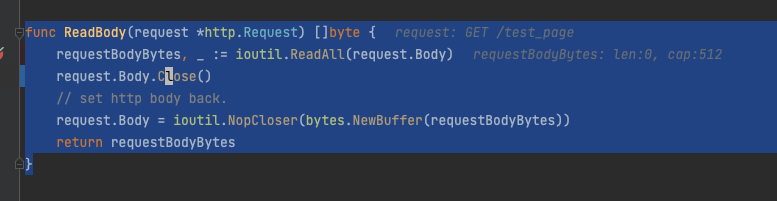

- [] whisky make install-git-hook 有 docker 提示日志
- [] 建行 js 更新
- [] ASN.1 证书（https 证书)
- [] frida 安装问题 https://blog.csdn.net/italan/article/details/122881957

whisky 问题 , ioutil ReadAll 分配内存高

1. 本地环境测试  
启动 vodka，修改 xika 地址: 172.31.33.213:9010, 启动whisky， 站点 是yuanyuan 测试
